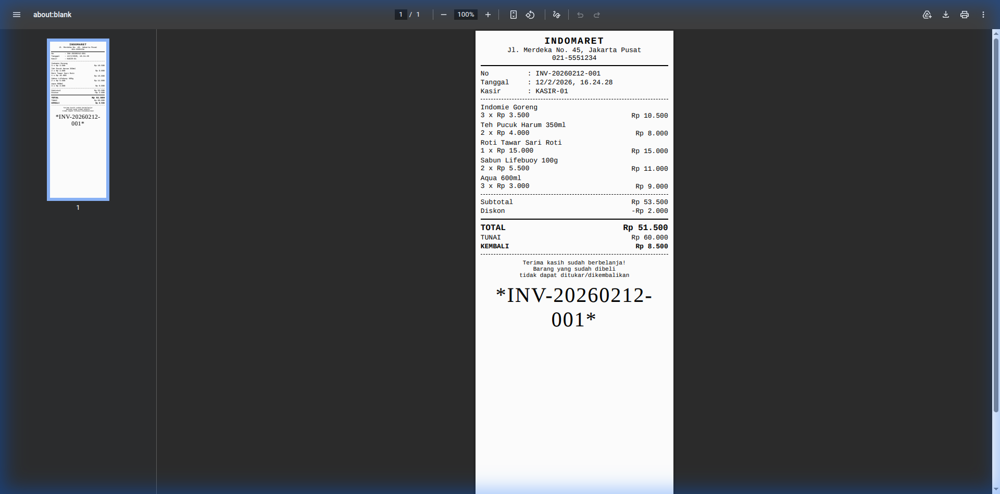
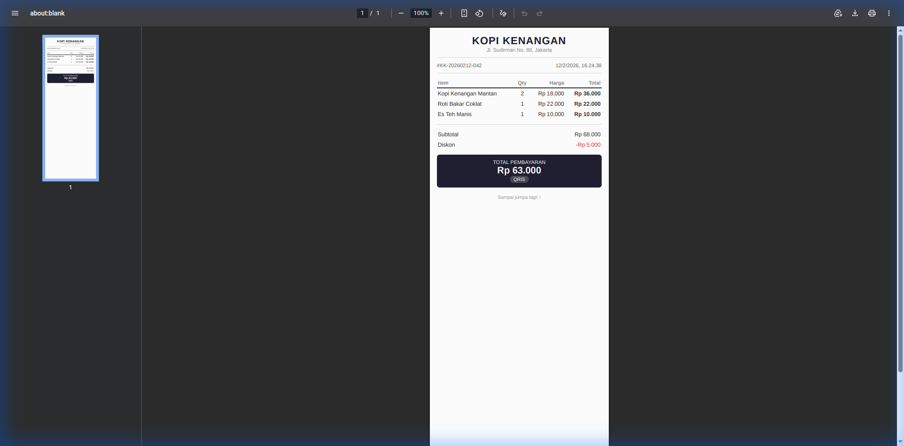
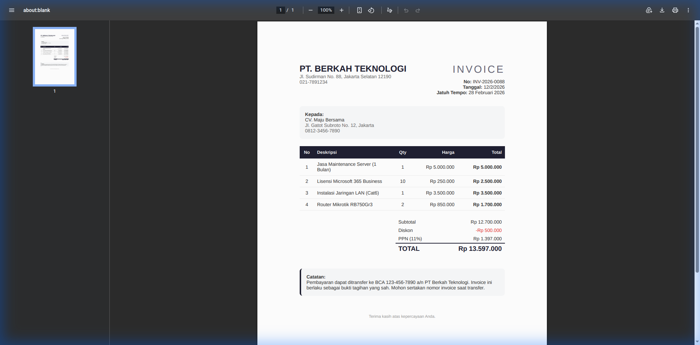
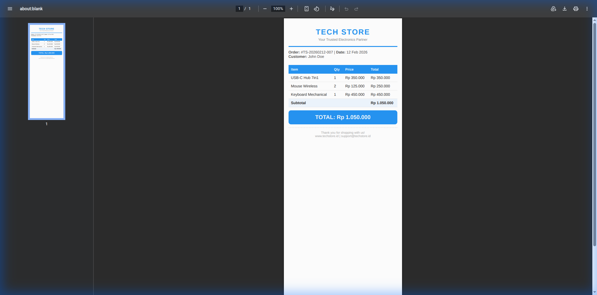

<p align="center">
  
  <h1 align="center">HTML to PDF API</h1>
  <p align="center">
    <strong>High-fidelity HTML/CSS to PDF converter — optimized for thermal receipts & invoices 🧾</strong>
  </p>
  <p align="center">
    <a href="https://hub.docker.com/r/bagose/html-to-pdf-api">
      
    </a>
    <a href="https://hub.docker.com/r/bagose/html-to-pdf-api">
      
    </a>
    <a href="https://github.com/volumeee/html-to-pdf-api/blob/main/LICENSE">
      
    </a>
  </p>
</p>

---

## ✨ Features

| Feature                 | Description                                          |
| ----------------------- | ---------------------------------------------------- |
| 🖨️ **Thermal Receipt**  | Optimized for 58mm, 80mm & custom width POS printers |
| 📝 **Template Engine**  | Pre-built templates: Indomaret, Modern, Invoice      |
| 📐 **Multi Page Sizes** | Thermal 58/80mm, A4, A5, Letter, Custom              |
| 🎨 **Full CSS Support** | Inline styles & `<style>` tags rendered accurately   |
| 📂 **File Management**  | List, download & delete generated PDFs               |
| 🗑️ **Auto Cleanup**     | Automatically removes old PDFs (configurable)        |
| 🐳 **Docker Ready**     | One command to deploy anywhere                       |
| 🔗 **Returns URL**      | Get a direct download link to the generated PDF      |

---

## 🚀 Quick Start

### Using Docker (Recommended)

```bash
docker run -d \
  --name html-to-pdf \
  --restart always \
  -p 3000:3000 \
  bagose/html-to-pdf-api:latest
```

Your API is now running at `http://localhost:3000` 🎉

### Using Node.js

```bash
git clone https://github.com/volumeee/html-to-pdf-api.git
cd html-to-pdf-api
npm install
npm start
```

---

## 📸 Output Examples

### 🧾 Indomaret Style Receipt

> Template: `indomaret` — Classic thermal receipt with barcode



<details>
<summary>📥 View Request Body</summary>

```json
{
  "template": "indomaret",
  "data": {
    "store_name": "INDOMARET",
    "store_address": "Jl. Merdeka No. 45, Jakarta Pusat",
    "store_phone": "021-5551234",
    "order_id": "INV-20260212-001",
    "cashier": "KASIR-01",
    "items": [
      { "name": "Indomie Goreng", "qty": 3, "price": 3500 },
      { "name": "Teh Pucuk Harum 350ml", "qty": 2, "price": 4000 },
      { "name": "Roti Tawar Sari Roti", "qty": 1, "price": 15000 },
      { "name": "Sabun Lifebuoy 100g", "qty": 2, "price": 5500 },
      { "name": "Aqua 600ml", "qty": 3, "price": 3000 }
    ],
    "discount": 2000,
    "payment": 60000,
    "payment_method": "TUNAI",
    "footer_message": "Terima kasih sudah berbelanja!"
  }
}
```

</details>

---

### ✨ Modern Minimal Receipt

> Template: `modern` — Clean, elegant design with dark total box



<details>
<summary>📥 View Request Body</summary>

```json
{
  "template": "modern",
  "data": {
    "store_name": "KOPI KENANGAN",
    "store_address": "Jl. Sudirman No. 88, Jakarta",
    "order_id": "KK-20260212-042",
    "items": [
      { "name": "Kopi Kenangan Mantan", "qty": 2, "price": 18000 },
      { "name": "Roti Bakar Coklat", "qty": 1, "price": 22000 },
      { "name": "Es Teh Manis", "qty": 1, "price": 10000 }
    ],
    "discount": 5000,
    "payment_method": "QRIS",
    "footer_message": "Sampai jumpa lagi! ☕"
  }
}
```

</details>

---

### 📄 Professional Invoice (A4)

> Template: `invoice` — Full-page invoice with PPN calculation & notes



<details>
<summary>📥 View Request Body</summary>

```json
{
  "template": "invoice",
  "data": {
    "store_name": "PT. BERKAH TEKNOLOGI",
    "store_address": "Jl. Sudirman No. 88, Jakarta Selatan 12190",
    "store_phone": "021-7891234",
    "order_id": "INV-2026-0088",
    "customer_name": "CV. Maju Bersama",
    "customer_address": "Jl. Gatot Subroto No. 12, Jakarta",
    "customer_phone": "0812-3456-7890",
    "due_date": "28 Februari 2026",
    "items": [
      {
        "name": "Jasa Maintenance Server (1 Bulan)",
        "qty": 1,
        "price": 5000000
      },
      { "name": "Lisensi Microsoft 365 Business", "qty": 10, "price": 250000 },
      { "name": "Instalasi Jaringan LAN (Cat6)", "qty": 1, "price": 3500000 },
      { "name": "Router Mikrotik RB750Gr3", "qty": 2, "price": 850000 }
    ],
    "discount": 500000,
    "notes": "Pembayaran dapat ditransfer ke BCA 123-456-7890 a/n PT Berkah Teknologi.",
    "footer_message": "Terima kasih atas kepercayaan Anda."
  }
}
```

</details>

---

### 🎨 Raw HTML (Custom Design)

> Endpoint: `POST /cetak_struk_pdf` — Any HTML/CSS you want



---

## 📡 API Reference

### Endpoints Overview

| Method   | Endpoint           | Description                           |
| -------- | ------------------ | ------------------------------------- |
| `POST`   | `/cetak_struk_pdf` | Generate PDF from raw HTML            |
| `POST`   | `/generate`        | Generate PDF from template            |
| `GET`    | `/templates`       | List available templates & page sizes |
| `GET`    | `/files`           | List all generated PDFs               |
| `DELETE` | `/files/:filename` | Delete a specific PDF                 |
| `POST`   | `/cleanup`         | Remove old PDFs                       |
| `GET`    | `/`                | Health check & API info               |

---

### `POST /cetak_struk_pdf`

Generate a PDF from raw HTML content.

#### Request Body

| Parameter      | Type     | Required | Description                                                                     |
| -------------- | -------- | -------- | ------------------------------------------------------------------------------- |
| `html_content` | `string` | ✅       | Full HTML string to render                                                      |
| `filename`     | `string` | ❌       | Custom filename (default: `struk_<timestamp>.pdf`)                              |
| `page_size`    | `string` | ❌       | One of: `thermal_58mm`, `thermal_80mm`, `thermal_default`, `a4`, `a5`, `letter` |
| `options`      | `object` | ❌       | `{ margin, landscape, format }`                                                 |

#### Example

```bash
curl -X POST http://localhost:3000/cetak_struk_pdf \
  -H "Content-Type: application/json" \
  -d '{
    "html_content": "<h1>Hello PDF!</h1><p>Generated via API</p>",
    "filename": "my_document.pdf",
    "page_size": "a4"
  }'
```

#### Response

```json
{
  "status": "success",
  "message": "PDF created successfully",
  "base_url": "http://localhost:3000",
  "file_url": "http://localhost:3000/output/my_document.pdf",
  "filename": "my_document.pdf",
  "page_size": "a4"
}
```

---

### `POST /generate`

Generate a PDF from a pre-built template.

#### Request Body

| Parameter   | Type     | Required | Description                                     |
| ----------- | -------- | -------- | ----------------------------------------------- |
| `template`  | `string` | ✅       | Template name: `indomaret`, `modern`, `invoice` |
| `data`      | `object` | ✅       | Template data (see examples above)              |
| `filename`  | `string` | ❌       | Custom filename                                 |
| `page_size` | `string` | ❌       | Override default page size                      |

#### Template Data Fields

<details>
<summary><strong>🧾 Indomaret & Modern Templates</strong></summary>

| Field            | Type     | Description              |
| ---------------- | -------- | ------------------------ |
| `store_name`     | `string` | Store name               |
| `store_address`  | `string` | Store address            |
| `store_phone`    | `string` | Store phone              |
| `order_id`       | `string` | Order/Invoice number     |
| `cashier`        | `string` | Cashier name             |
| `date`           | `string` | Transaction date         |
| `items`          | `array`  | `[{ name, qty, price }]` |
| `discount`       | `number` | Discount amount          |
| `tax`            | `number` | Tax amount               |
| `payment`        | `number` | Payment amount           |
| `payment_method` | `string` | e.g., TUNAI, QRIS, DEBIT |
| `footer_message` | `string` | Custom footer text       |

</details>

<details>
<summary><strong>📄 Invoice Template</strong></summary>

All fields from Indomaret/Modern, plus:

| Field              | Type     | Description           |
| ------------------ | -------- | --------------------- |
| `customer_name`    | `string` | Customer/Company name |
| `customer_address` | `string` | Customer address      |
| `customer_phone`   | `string` | Customer phone        |
| `due_date`         | `string` | Payment due date      |
| `notes`            | `string` | Additional notes      |

</details>

---

### `GET /files`

List all generated PDF files.

```bash
curl http://localhost:3000/files
```

```json
{
  "total": 4,
  "files": [
    {
      "filename": "example_invoice.pdf",
      "url": "http://localhost:3000/output/example_invoice.pdf",
      "size_kb": 71,
      "created": "2026-02-12T16:24:18.377Z"
    }
  ]
}
```

---

### `POST /cleanup`

Remove PDFs older than specified hours.

```bash
curl -X POST http://localhost:3000/cleanup \
  -H "Content-Type: application/json" \
  -d '{"max_age_hours": 12}'
```

---

## 📐 Page Size Presets

| Preset            | Width         | Best For                  |
| ----------------- | ------------- | ------------------------- |
| `thermal_58mm`    | 220px         | Small thermal printers    |
| `thermal_80mm`    | 302px         | Standard thermal printers |
| `thermal_default` | 380px         | Wide thermal / preview    |
| `a4`              | 210mm × 297mm | Invoices, documents       |
| `a5`              | 148mm × 210mm | Half-page documents       |
| `letter`          | 8.5in × 11in  | US standard paper         |

---

## 🔧 Environment Variables

| Variable                    | Default | Description                           |
| --------------------------- | ------- | ------------------------------------- |
| `PORT`                      | `3000`  | Server port                           |
| `AUTO_CLEANUP_HOURS`        | `24`    | Auto-delete PDFs older than X hours   |
| `PUPPETEER_EXECUTABLE_PATH` | —       | Custom Chromium path (auto in Docker) |

---

## 🐳 Docker Commands

```bash
# Pull & Run
docker run -d --name html-to-pdf --restart always -p 3000:3000 bagose/html-to-pdf-api:latest

# View logs
docker logs -f html-to-pdf

# Stop & remove
docker stop html-to-pdf && docker rm html-to-pdf

# Build locally
docker build -t html-to-pdf-api .
```

---

## 🏗️ Tech Stack

| Technology     | Purpose                         |
| -------------- | ------------------------------- |
| **Node.js 20** | Runtime                         |
| **Express**    | HTTP Server                     |
| **Puppeteer**  | HTML rendering & PDF generation |
| **Chromium**   | Headless browser engine         |
| **Docker**     | Containerization                |

---

## 📁 Project Structure

```
html-to-pdf-api/
├── server.js              # Main API server (templates + endpoints)
├── package.json           # Dependencies
├── Dockerfile             # Docker build config
├── .dockerignore          # Docker ignore rules
├── .gitignore             # Git ignore rules
├── .env                   # Environment variables
├── LICENSE                # MIT License
├── examples/              # Sample outputs
│   ├── example_indomaret.pdf
│   ├── example_modern.pdf
│   ├── example_invoice.pdf
│   ├── example_raw_html.pdf
│   ├── screenshot_indomaret.png
│   ├── screenshot_modern.png
│   ├── screenshot_invoice.png
│   └── screenshot_raw_html.png
└── output/                # Generated PDF files (runtime)
```

---

## 🤝 Integration with n8n

This API is designed to work seamlessly with **n8n** workflows and AI Agents:

```json
{
  "method": "POST",
  "url": "https://your-domain.com/generate",
  "body": {
    "template": "indomaret",
    "data": {
      "store_name": "{{ $json.business_name }}",
      "order_id": "{{ $json.order_id }}",
      "items": "{{ $json.raw_items }}",
      "payment": "{{ $json.grand_total }}"
    }
  }
}
```

---

## 📝 License

This project is open source and available under the [MIT License](LICENSE).

---

<p align="center">
  Made with ❤️ by <a href="https://github.com/volumeee">volumeee</a>
</p>
